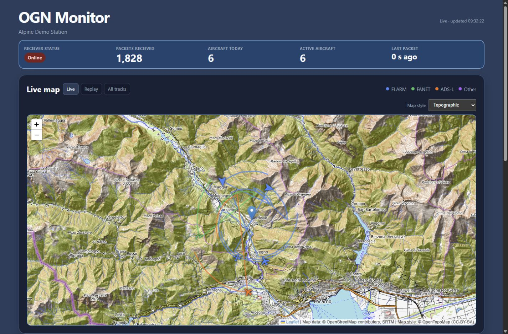
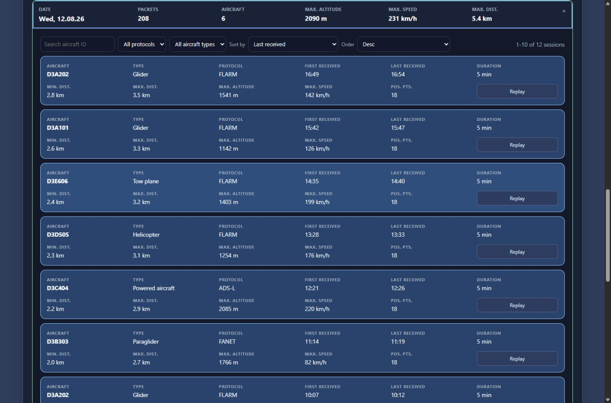
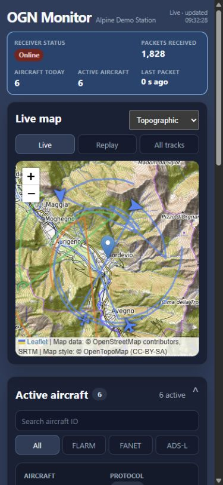

# OGN Monitor

OGN Monitor is a lightweight web dashboard for a local Open Glider Network receiver. It is designed for Raspberry Pi installations and uses Flask, SQLite and Leaflet without Grafana or an external database.

See the project-wide **[Changelog](CHANGELOG.md)** for release history, fixes and links to individual commits.

The dashboard provides:

- live receiver and traffic statistics;
- live aircraft markers, protocol colours and recent tracks;
- aircraft-type icons and public OGN Devices Database metadata;
- daily activity and sortable flight-session history;
- map replay for recorded sessions;
- all-time coverage views by density or altitude;
- street, topographic and satellite base maps;
- Raspberry Pi resource and service health information.

## Screenshots

The examples below use synthetic aircraft, sessions and an approximate public map centre. They do not contain receiver data or a private installation location.

### Live dashboard



### Flight-session history



### Mobile layout



## Public edition scope

This repository intentionally does **not** include:

- an automatic reboot or connectivity watchdog;
- country-specific aircraft categories;
- HTTPS, reverse-proxy or public Internet exposure configuration.

It serves plain HTTP on port `5000`. Use it on a trusted local network. If you later expose it publicly, choose and maintain an appropriate reverse proxy and security policy yourself.

## Requirements

- Raspberry Pi OS or another Debian-like Linux distribution;
- Python 3.11 or newer;
- an OGN decoder that exposes APRS lines on a TCP socket (default `127.0.0.1:50001`);
- `python3-venv`, `curl` and `systemd` for the assisted installation.

The decoder itself is not included. OGN Monitor starts at the decoder's local TCP output.

## Quick start

For a complete new-device walkthrough, including decoder verification, service checks, updates, backups and troubleshooting, read the **[Raspberry Pi installation guide](docs/INSTALLATION.md)**.

```sh
git clone https://github.com/MakeITBetterSAGL/ogn-monitor.git
cd ogn-monitor
sudo apt update
sudo apt install -y python3-venv curl
./scripts/install.sh
```

Edit `.env` and set at least:

```dotenv
OGN_STATION_NAME="My OGN Station"
OGN_STATION_LATITUDE="0.000000"
OGN_STATION_LONGITUDE="0.000000"
OGN_TIMEZONE="UTC"
```

Then initialize aircraft metadata and start the services:

```sh
./scripts/update-ogn-ddb.sh
sudo systemctl enable --now ogn-collector ogn-parser ogn-monitor ogn-ddb-update.timer
```

Open `http://<raspberry-pi-address>:5000`.

## Configuration

Copy [`config.example.env`](config.example.env) to `.env`. The service reads this file at startup.

| Variable | Default | Description |
|---|---:|---|
| `OGN_STATION_NAME` | `My OGN Station` | Name shown in the dashboard |
| `OGN_STATION_LATITUDE` | `0` | Receiver latitude in decimal degrees |
| `OGN_STATION_LONGITUDE` | `0` | Receiver longitude in decimal degrees |
| `OGN_TIMEZONE` | `UTC` | IANA time zone used for days and times |
| `OGN_DECODER_HOST` | `127.0.0.1` | Decoder TCP host |
| `OGN_DECODER_PORT` | `50001` | Decoder TCP port |
| `OGN_ACTIVE_MINUTES` | `10` | Active-aircraft window |
| `OGN_TRACK_MINUTES` | `30` | Recent-track window |
| `OGN_ONLINE_SECONDS` | `120` | Packet freshness used for active traffic |
| `OGN_SESSION_GAP_MINUTES` | `20` | Gap that separates two flight sessions |

## Services

The installer creates four systemd services/timers:

- `ogn-collector`: records APRS packets in SQLite;
- `ogn-parser`: converts pending packets into positions;
- `ogn-monitor`: serves the dashboard on HTTP port 5000;
- `ogn-ddb-update.timer`: refreshes the public OGN device database daily.

Useful commands:

```sh
systemctl status ogn-collector ogn-parser ogn-monitor
journalctl -u ogn-monitor -f
sudo systemctl restart ogn-collector ogn-parser ogn-monitor
```

## Data and backups

Runtime data is stored under `database/` and excluded from Git. To migrate an installation, stop the three services and copy:

- the complete project directory;
- `.env`;
- `database/ogn.sqlite3` and any `-wal`/`-shm` files if present.

For a consistent backup, stop the writer services first or use SQLite's backup command.

## Privacy and external services

Aircraft metadata is read from the public OGN Devices Database. The map uses external tile providers and displays their required attribution. Aircraft owners can choose privacy and tracking settings in the source OGN database; the dashboard only displays identified public records.

## Development

For a local development run:

```sh
python3 -m venv .venv
. .venv/bin/activate
pip install -r requirements.txt
cp config.example.env .env
set -a; . ./.env; set +a
python collector.py
```

Run `parser.py` and `app.py` in separate terminals. The Flask development server listens on port 5000; production installations use Gunicorn through systemd.

## License

MIT. See [`LICENSE`](LICENSE).
