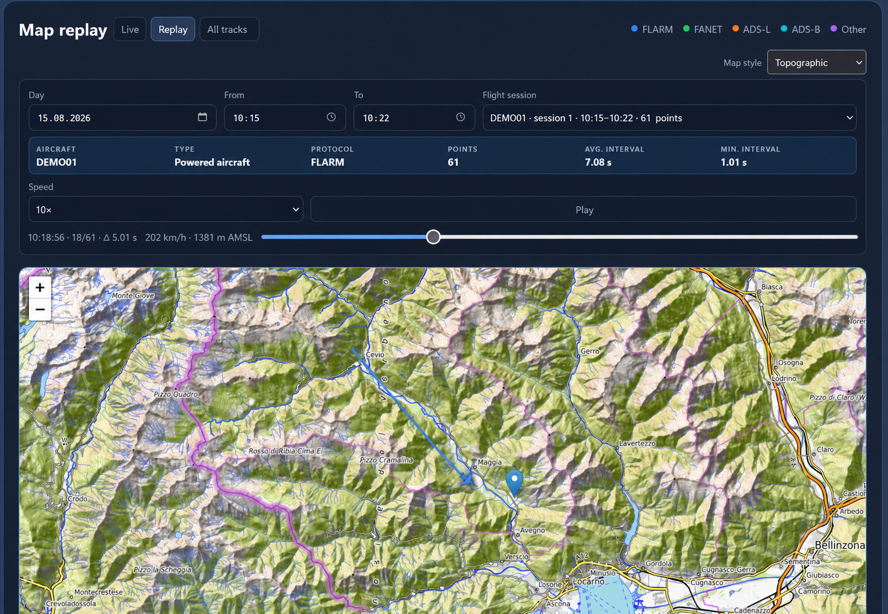
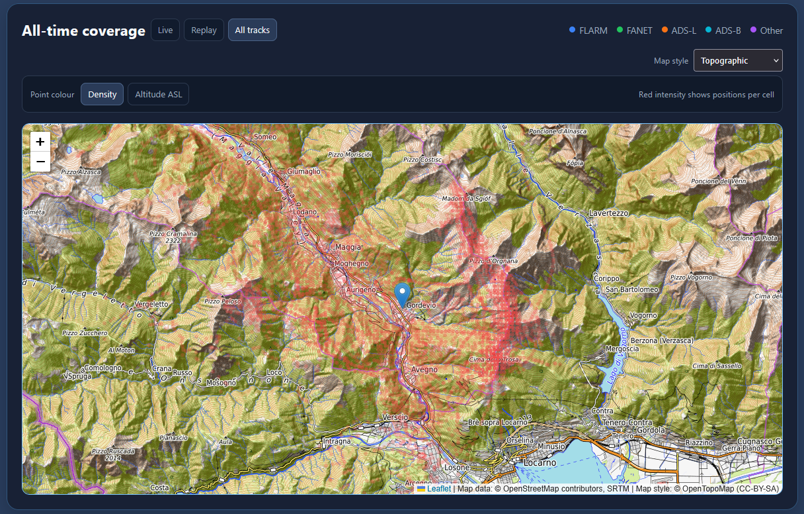
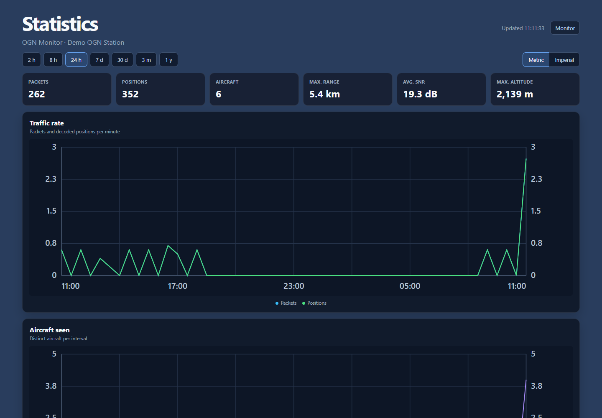
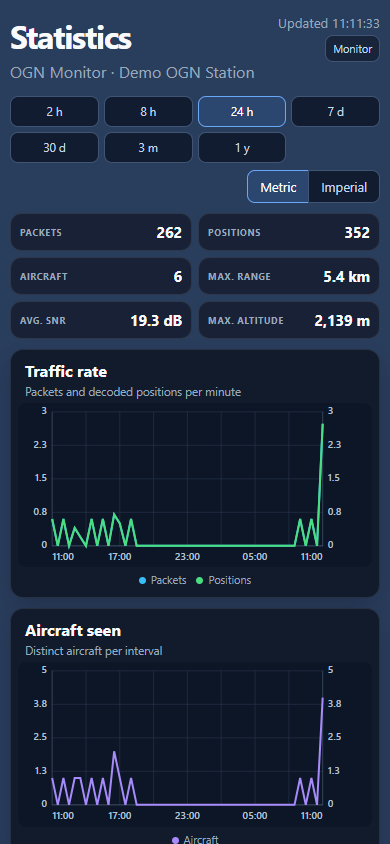

# OGN Monitor

OGN Monitor is a lightweight web dashboard for a local Open Glider Network receiver. It recognizes OGN, FLARM, FANET, ADS-L and ADS-B traffic forwarded by the configured decoder. It is designed for Raspberry Pi and Docker installations and uses Flask, SQLite and Leaflet without Grafana or an external database.

See the project-wide **[Changelog](CHANGELOG.md)** for release history, fixes and links to individual commits. Existing installations should follow the **[upgrade guide](UPGRADING.md)**.

The dashboard provides:

- live receiver and traffic statistics;
- live aircraft markers, protocol colours and recent tracks;
- aircraft-type icons and public OGN Devices Database metadata;
- daily activity and sortable flight-session history;
- map replay for recorded sessions;
- selectable Replay time windows with automatic session start and end times;
- high-resolution replay telemetry with point timing, altitude and speed;
- all-time coverage views by density or altitude;
- a responsive Statistics page with selectable time ranges and seven charts;
- shared metric and imperial display units;
- street, topographic and satellite base maps;
- Receiver health on native Raspberry Pi installations and container-safe Application health in Docker.

## Screenshots

The examples below use synthetic aircraft, sessions and an approximate public map centre. They do not contain receiver data or a private installation location.

### Live dashboard


### Flight-session history


### Session replay



### All-time coverage



### Mobile layout


### Statistics



### Statistics on mobile



## Public edition scope

This repository contains the portable OGN Monitor core and uses generic station settings. It serves the dashboard on local HTTP port `5000` and is intended for a trusted local network.

## Requirements

- Raspberry Pi OS or another Debian-like Linux distribution;
- Python 3.11 or newer;
- an OGN decoder that exposes APRS lines on a TCP socket (default `127.0.0.1:50001`);
- `python3-venv`, `curl` and `systemd` for the assisted installation.

The decoder itself is not included. OGN Monitor starts at the decoder's local TCP output.

Docker is also supported for the OGN Monitor application. The decoder and its
radio drivers remain on the host. See the **[Docker guide](docs/DOCKER.md)**.

ADS-B support identifies traffic already forwarded through the configured APRS
decoder. OGN Monitor does not include a 1090 MHz receiver, radio drivers or a
replacement for dedicated ADS-B software such as tar1090.

## Quick start

For a complete new-device walkthrough, including decoder verification, service checks, updates and troubleshooting, read the **[Raspberry Pi installation guide](docs/INSTALLATION.md)**.

```sh
git clone https://github.com/MakeITBetterSAGL/ogn-monitor.git
cd ogn-monitor
sudo apt update
sudo apt install -y python3-venv curl
./scripts/install.sh
```

Edit `.env` and set at least:

```dotenv
OGN_STATION_NAME="My OGN Station"
OGN_STATION_LATITUDE="0.000000"
OGN_STATION_LONGITUDE="0.000000"
OGN_TIMEZONE="UTC"
```

Then initialize aircraft metadata and start the services:

```sh
./scripts/update-ogn-ddb.sh
sudo systemctl enable --now ogn-collector ogn-parser ogn-monitor ogn-ddb-update.timer ogn-retention.timer
```

Open `http://<raspberry-pi-address>:5000`.

### Docker quick start

```sh
cp docker.env.example docker.env
# Edit docker.env before starting the application.
docker compose --env-file docker.env up --build -d
```

Open `http://<docker-host-address>:5000` (or the `OGN_HTTP_PORT` configured in
`docker.env`). Keep using `--env-file docker.env` in Compose commands so the
host-port setting is applied. The named `ogn-data` volume keeps the
SQLite database and public aircraft metadata when the container is recreated.
The complete setup and decoder-network requirements are documented in
[`docs/DOCKER.md`](docs/DOCKER.md).

## Configuration

Copy [`config.example.env`](config.example.env) to `.env`. The service reads this file at startup.

| Variable | Default | Description |
|---|---:|---|
| `OGN_STATION_NAME` | `My OGN Station` | Name shown in the dashboard |
| `OGN_STATION_LATITUDE` | `0` | Receiver latitude in decimal degrees |
| `OGN_STATION_LONGITUDE` | `0` | Receiver longitude in decimal degrees |
| `OGN_TIMEZONE` | `UTC` | IANA time zone used for days and times |
| `OGN_DECODER_HOST` | `127.0.0.1` | Decoder TCP host |
| `OGN_DECODER_PORT` | `50001` | Decoder TCP port |
| `OGN_ACTIVE_MINUTES` | `10` | Active-aircraft window |
| `OGN_TRACK_MINUTES` | `30` | Recent-track window |
| `OGN_ONLINE_SECONDS` | `120` | Packet freshness used for active traffic |
| `OGN_SESSION_GAP_MINUTES` | `20` | Gap that separates two flight sessions |
| `OGN_FILTER_MAX_RADIUS_KM` | disabled | Reject new positions beyond this radius from the configured station coordinates |
| `OGN_FILTER_MIN_ALTITUDE_M` | disabled | Reject new positions below this altitude in metres AMSL |
| `OGN_FILTER_MAX_ALTITUDE_M` | disabled | Reject new positions above this altitude in metres AMSL |
| `OGN_RETENTION_DAYS` | `365` | Delete packets and positions older than this many days during scheduled cleanup |
| `OGN_DDB_FILE` | `database/ogn-ddb.json` | Public aircraft metadata file; Docker uses `/data/ogn-ddb.json` |
| `OGN_RUNTIME_MODE` | `native` | Selects native Receiver health or Docker Application health |

## Services

The installer creates the application services and maintenance timers:

- `ogn-collector`: records APRS packets in SQLite;
- `ogn-parser`: converts pending packets into positions;
- `ogn-monitor`: serves the dashboard on HTTP port 5000;
- `ogn-ddb-update.timer`: refreshes the public OGN device database daily.
- `ogn-retention.timer`: removes data older than the configured retention period daily.

Useful commands:

```sh
systemctl status ogn-collector ogn-parser ogn-monitor
journalctl -u ogn-monitor -f
sudo systemctl restart ogn-collector ogn-parser ogn-monitor
```

## Data storage

Runtime data is stored under `database/` and excluded from Git. Receiver-specific settings are stored in `.env`, which is also excluded from Git.

Docker stores runtime data in the named `ogn-data` volume and reads
receiver-specific settings from the ignored `docker.env` file.

## Privacy and external services

Aircraft metadata is read from the public OGN Devices Database. The map uses external tile providers and displays their required attribution. Aircraft owners can choose privacy and tracking settings in the source OGN database; the dashboard only displays identified public records.

## Development

For a local development run:

```sh
python3 -m venv .venv
. .venv/bin/activate
pip install -r requirements.txt
cp config.example.env .env
set -a; . ./.env; set +a
python collector.py
```

Run `parser.py` and `app.py` in separate terminals. The Flask development server listens on port 5000; production installations use Gunicorn through systemd.

## License

MIT. See [`LICENSE`](LICENSE).
